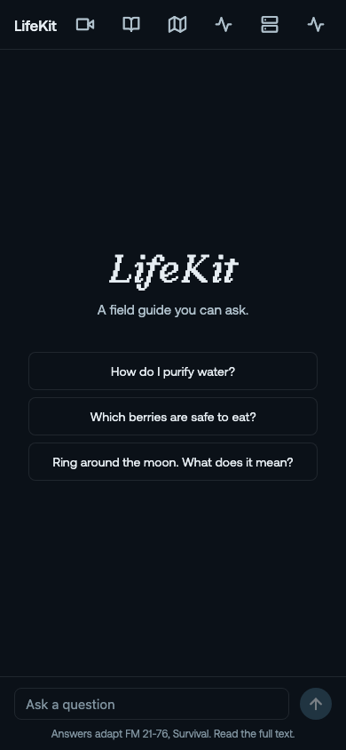
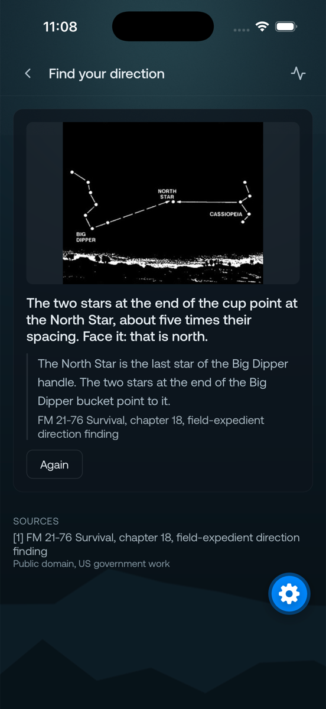
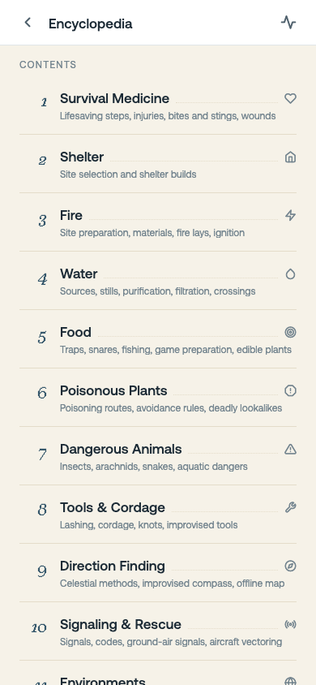

# LifeKit

A field guide you can ask. LifeKit is an offline survival companion: a phone app backed by
one local server and one inference box, with no internet dependence at answer time. Every
answer draws on a content pack built ahead of time from public-domain sources, led by the
US Army Survival Manual FM 21-76, and on models running on hardware in the room.

The intended reader uses it half an hour a day: as evening reading, as a reference when a
question comes up, and as a camera-guided walk when something needs identifying or tying.

The premise is knowledge surviving infrastructure failure. If the network vanished
tomorrow, what would you still want humanity to remember? Knots, plants, animals,
weather, navigation, water, first aid, and basic construction all belong because they
answer that question.

<p align="center">
  
  
  
</p>

## What it does

**Ask.** The chat answers every question. When full-text search finds pack passages for
it, the answer quotes them and links the chapters; a book line under the answer opens the
cited chapter. When the pack has no coverage, the model answers plainly, says so, and
records the topic in a research queue that an online pass can work through later.

**Read.** The manual serves as a twelve-tile encyclopedia with typed blocks, warnings on
their own red cards, extracted figures, and full-text search. The bundled FM 21-76 PDF
opens with per-chapter deep links.

**Look.** Camera surfaces share one loop that takes a single deliberate look at a time:
identification walks (fungi, berries) answer one question per clip and ask the user to
confirm before anything writes; the coach follows a knot or a tourniquet step by step and
advances only when two clips agree; the sky reader joins a cloud description with NOAA
climate normals for the place and month. A voice interview covers each model wait, and
every question keeps tappable options, so voice stays optional.

**Navigate.** The map serves offline vector tiles with hillshade from the server's
PMTiles archives. It streams the GPS position, answers "how far am I from water" from an
OpenStreetMap-derived feature layer, and draws the route there: a trail route planned on
the phone over a fetched graph corridor, bending around hazard markers, with a straight
bearing line as the stated fallback. Markers work like saved places: long-press to add
with a name and a category tag, browse and filter them in a list, tap to fly there and
edit.

**Listen and speak.** Parakeet transcribes on the box, batch or streaming; Kokoro narrates
back. The traces tab shows which model produced each result and how long it took.

**Grow.** LifeKit improves itself. When it lacks a reliable stored source, it saves the
question: the chat says so in its answer, and the topic joins a research queue you can
review. Once connectivity returns, an agent works the queue, finds the missing material,
verifies and organizes it, and expands the local library for the next time. The longer
you travel with it, the better it understands where you are, what you carry, and what you
may need to know: markers, observations, and asked questions all feed the pack that
serves you.

## How it works

Four codebases ship on their own schedules and meet at two seams: the HTTP contract
(`contracts/flux-server.openapi.json`, mirrored in the app's TypeScript types) and the
pack format (`contracts/pack-format.md`).

The phone talks only to flux-server on the local network. The server reads the pack
read-only and forwards inference to the box services through SSH tunnels: Nemotron Nano
9B answers chat, Cosmos-Reason2-8B reads clips, NVIDIA VSS summarizes trail recordings,
and a perception service ranks species labels (SpeciesNet, BioCLIP, FungiTastic). A dead
tunnel or an unset variable degrades one route to an explanatory 503; the app states what
is missing instead of inventing an answer.

Agents divide the work around that spine. On the box, the VSS agent manages the video
stack, and the research-queue worker is the box's online errand: it googles the saved
questions when the box has internet, pulls what it finds, and stages it for the pack. At
build time, pipeline agents turn sources into pack artifacts (the manual parse, the walk
tables, the map layers). In the app, nothing agentic runs: every surface is a
deterministic walk over what the agents prepared, so the phone stays predictable when it
is the only computer left.

## Layout

- `app/`: the Expo (React Native) app.
- `server/`: the FastAPI server the app talks to.
- `pipeline/`: `flux-pipeline` builds the pack: manual parsing, walk compilation, figure
  extraction, and the OSM-derived map artifacts (water features, trail graph).
- `box/`: provisioning for the GN100 inference box: model and data manifests, VSS
  bring-up, the perception and speech services.
- `contracts/`: the OpenAPI export and the pack-format description the parties code
  against.

## Run

One-time setup from a fresh clone:

```
uv sync --all-packages
```

Server:

```
cd server
uv run flux-server
```

Each route names its own dependency and answers 503 while it is unset: `FLUX_CONTENT_DB`
(the pack), `FLUX_NEMOTRON_URL` and `FLUX_COSMOS_URL` (box model endpoints),
`FLUX_TILE_ARCHIVE` and `FLUX_TILE_ARCHIVE_TERRAIN` (map tiles), `FLUX_FEATURES_DB` (the
water-feature layer), `FLUX_TRAILS_DB` (the trail graph), `FLUX_SPEECH_URL` and
`FLUX_PERCEPTION_URL` (box services).

App:

```
cd app
npm install
npx expo start
```

Open the dev client on the phone and point the connect screen at `http://<mac-ip>:8000`.
Camera surfaces need the compiled dev client (`npx expo run:ios --device`).

## Tests

```
uv run pytest server/tests -q
```

`npx tsc --noEmit` in `app/` is the frontend gate.

## Tickets

Work runs through GitHub issues in `reversely/flux`, one issue per commit to `main` (see
CLAUDE.md). Pinned issue #20 maps the four parallel workstreams to directory boundaries.

## Sources and licenses

Pack content comes from public-domain and openly licensed sources, each carrying its
attribution in the pack: FM 21-76 (US government work), OpenStreetMap map artifacts
(ODbL, © OpenStreetMap contributors), NOAA climate normals, and per-figure source lines
in the encyclopedia.
